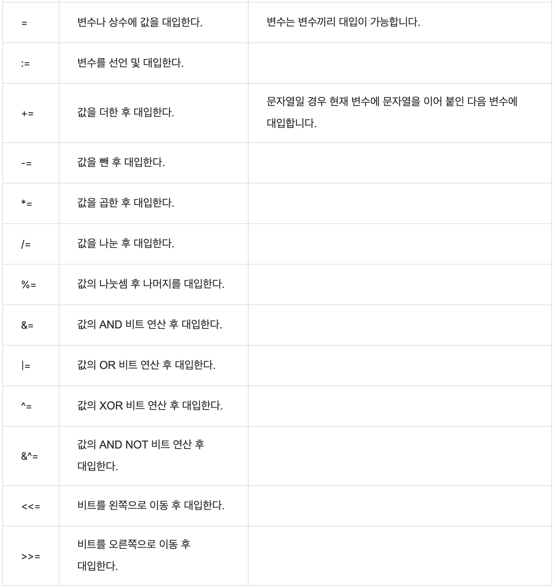
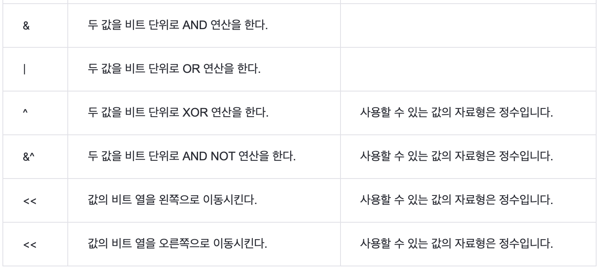
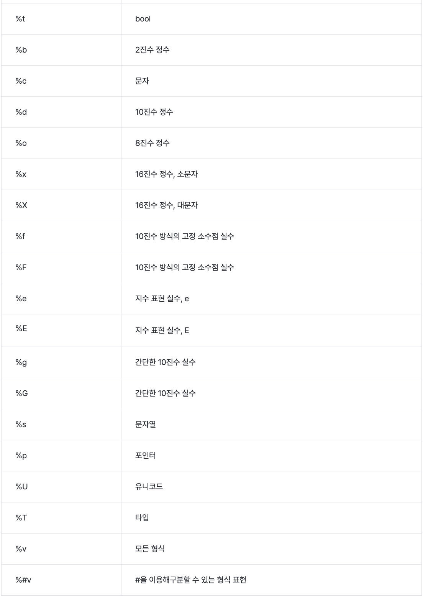

# 0. 콘솔 출력 함수의 기본

```go
package main

import "fmt"

func main() {
    var num1 int = 1
    var num2 int = 2

    fmt.Print("Hello goorm!", num1, num2, "\n")

    fmt.Println("Hello goorm!", num1, num2)

    fmt.Printf("num1의 값은:%d num2의 값은:%d\n", num1, num2)
}
```

```
Hello goorm!1 2
Hello goorm! 1 2
num1의 값은:1 num2의 값은:2
```

# 1. 변수와 상수

- 선언만 하고 사용하지 않았을 시 에러
  - 이유 없이 메모리를 차지하게 두지 않음
- 선언 후 초기값을 설정하지 않으면 zero value(false, 0, "")

```go
package main

import "fmt"

var globalA = 5 //함수 밖에서는 'var' 키워드를 입력해야함.
				// 꼭 형을 명시하지 않아도 됨
func main() {
    var a string = "goorm"
    fmt.Println(a)

    var b int = 10
    fmt.Println(b)

    var d = true
    fmt.Println(d)

    var e int
    fmt.Println(e)

    f := "short"
    fmt.Println(f)

	fmt.Println(globalA)

    var a, b int = 10, 20
    fmt.Println(a, b)

	i, j, k := 1, 2, 3
    fmt.Println(i, j, k)

    var str1, str2 string = "Hello", "goorm"
    fmt.Println(str1, str2)
}
```

```
goorm
10
true
0
short
5
10 20
1 2 3
Hello goorm
```

- 상수 선언

```go
import "fmt"

const (
	c1 = 10 //첫 번째 값은 무조건 초기화해야 함
	c2
	c3
	c4 = "goorm" //다른 형 선언 가능
	c5
	c6 = iota //c8까지 index값 저장
	c7
	c8
	c9 = "earth"
	c10
	c11 = "End"
)

func main() {
	fmt.Println(c1, c2, c3, c4, c5, c6, c7, c8, c9, c10, c11)
}
```

```
10 10 10 goorm goorm 5 6 7 earth earth End
```

# 2. 연산자

```go
package main

import "fmt"

func main() {
	num1, num2 := 17, 5
	str1, str2 := "Hello", "goorm!"

	fmt.Println("num1 + num2 =", num1+num2)
	fmt.Println("str1 + str2 =", str1+str2)
	fmt.Println("num1 - num2 =", num1-num2)
	fmt.Println("num1 * num2 =", num1*num2)
	fmt.Println("num1 / num2 =", num1/num2)
	fmt.Println("num1 % num2 =", num1%num2)

    count1, count2 := 1, 10.4

	count1++
	count2--

	fmt.Println("count1++ :", count1)
	fmt.Println("count2-- :", count2)
}
```

```
num1 + num2 = 22
str1 + str2 = Hellogoorm!
num1 - num2 = 12
num1 * num2 = 85
num1 / num2 = 3
num1 % num2 = 2
count1++ : 2
count2-- : 9.4
```



```go
package main

import "fmt"

func main() {
	a := 2
	var num int

	num = a
	fmt.Println("num = a :", num)
	num += 4
	fmt.Println("num += 4 :", num)
	num -= 2
	fmt.Println("num -= 2 :", num)
	num *= 5
	fmt.Println("num *= 5 :", num)
	num /= 2
	fmt.Println("num /= 2 :", num)
	num %= 3
	fmt.Println("num %= 3 :", num)

	num = 3  //00000011
	num &= 2 //00000010
	fmt.Printf("num &= 2 : %08b, %d\n", num, num)
	num |= 5 //00000101
	fmt.Printf("num |= 5 : %08b, %d\n", num, num)
	num ^= 4 //00000100
	fmt.Printf("num ^= 4 : %08b, %d\n", num, num)
	num &^= 2 //00000010
	fmt.Printf("num &^= 2 : %08b, %d\n", num, num)
	num <<= 9 //00001001
	fmt.Printf("num <<= 9 : %08b, %d\n", num, num)
	num >>= 8 //00001000
	fmt.Printf("num >>= 8 : %08b, %d\n", num, num)
}
```

```
num = a : 2
num += 4 : 6
num -= 2 : 4
num *= 5 : 20
num /= 2 : 10
num %= 3 : 1
num &= 2 : 00000010, 2
num |= 5 : 00000111, 7
num ^= 4 : 00000011, 3
num &^= 2 : 00000001, 1
num <<= 9 : 1000000000, 512
num >>= 8 : 00000010, 2
```

- 논리

```go
package main

import "fmt"

func main() {
	var a bool = true
	b := false

	fmt.Println("0 && 0 : ", b && b)
	fmt.Println("0 && 1 : ", b && a)
	fmt.Println("1 && 1 : ", a && a)
	fmt.Println("0 || 0 : ", b || b)
	fmt.Println("0 || 1 : ", b || a)
	fmt.Println("1 || 1 : ", a || a)

	fmt.Println("!1 ", !true)
	fmt.Println("!0 ", !false)
}
```

```
0 && 0 :  false
0 && 1 :  false
1 && 1 :  true
0 || 0 :  false
0 || 1 :  true
1 || 1 :  true
!1  false
!0  true
```

- 비트
  

```go
package main

import "fmt"

func main() {
	num1 := 15 //00001111
	num2 := 20 //00010100

	fmt.Printf("num1 & num2 : %08b, %d\n", num1&num2, num1&num2)
	fmt.Printf("num1 | num2 : %08b, %d\n", num1|num2, num1|num2)
	fmt.Printf("num1 ^ num2 : %08b, %d\n", num1^num2, num1^num2)
	fmt.Printf("num1 &^ num2 : %08b, %d\n", num1&^num2, num1&^num2)

	fmt.Printf("num1 << 4 : %08b, %d\n", num1<<4, num1<<4)
	fmt.Printf("num2 >> 2 : %08b, %d\n", num2>>2, num2>>2)
}
```

```
num1 & num2 : 00000100, 4
num1 | num2 : 00011111, 31
num1 ^ num2 : 00011011, 27
num1 &^ num2 : 00001011, 11
num1 << 4 : 11110000, 240
num2 >> 2 : 00000101, 5
```

- **채널**
  - `<-` 채널에 값을 보내거나 가져옴

```go
package main

import "fmt"

func main() {
	ch := make(chan int) //정수형 채널 생성

	go func() {
		ch <- 10
	}() //채널에 10을 보냄

	result := <-ch //채널로부터 10을 전달받음
	fmt.Println(result)
}
```

```
10
```

- 포인터
  - 포인터를 더하고 빼는 기능은 제공하지 않음
  - `&`: 변수의 메모리 주소 참조
  - `*`: 포인터 변수에 저장된 메모리에 접근하여 값 참조

```go
package main

import "fmt"

func main() {
	var num int = 5
	var pnum = &num

	fmt.Println("num : ", num)   //num 값
	fmt.Println("pnum :", pnum)  //num의 메모리 주소
	fmt.Println("pnum :", *pnum) //num의 주소로 메모리에 할당돼있는 값 접근

	*pnum++
	fmt.Println("num : ", num)
	fmt.Println("pnum :", *pnum)
	//포인터 연산자를 이용한 값 변경
}
```

```
num :  5
pnum : 0xc0000160c8
pnum : 5
num :  6
pnum : 6
```

```go
package main

import "fmt"

func main() {
	var num1, num2, num3 int

	fmt.Print("정수 3개를 입력하세요 :")
	fmt.Scanln(&num1, &num2, &num3)
	fmt.Println(num1, num2, num3)
}
```

# 3. 자료형

```go
package main

import "fmt"

func main() {
	// Raw String Literal. 복수라인.
	var rawLiteral string = `바로 실행해보면서 배우는 \n Golang`

	// Interpreted String Literal
	var interLiteral string = "바로 실행해보면서 배우는 \nGolang"

	plusString := "구름 " + "EDU\n" + "Golang"

	fmt.Println(rawLiteral)
	fmt.Println()
	fmt.Println(interLiteral)
	fmt.Println()
	fmt.Println(plusString)
}
```

```
바로 실행해보면서 배우는 \n Golang

바로 실행해보면서 배우는
Golang

구름 EDU
Golang
```

- **형변환**

```go
package main

import "fmt"

func main() {
	var num int = 10
	var changef float32 = float32(num) //int형을 float32형으로 변환
	changei := int8(num)               //int형을 int8형으로 변환

	var str string = "goorm"
	changestr := []byte(str) //바이트 배열
	str2 := string(changestr) //바이트 배열을 다시 문자열로 변환

	fmt.Println(num)
	fmt.Println(changef, changei)

	fmt.Println(str)
	fmt.Println(changestr)
	fmt.Println(str2)
}
```

```
10
10 10
goorm
[103 111 111 114 109]
goorm
```

# 4. 콘솔 출력과 입력 함수

- fmt 패키지의 콘솔 출력 함수는 Println, Print, Printf 외에도 파일 출력을 위한 Fprintln, Fprint, Fprintf와 string형으로 반환되는 Sprintln, Sprint, Sprintf가 있음
- %v 문자를 이용해 변수의 타입에 관계없이 출력 가능



```go
package main

import "fmt"

func main() {
	fmt.Printf("5>6=%b\n", 5 > 6)
	fmt.Printf("15는 2진수로 %b\n", 15)
	fmt.Printf("저의 성은 %c 입니다\n", '김')
	fmt.Printf("19는 10진수로 %d입니다.\n", 19)
	fmt.Printf("19는 8진수로 %o입니다.\n", 19)
	fmt.Printf("19는 16진수로 %x입니다.\n", 19)
	fmt.Printf("19는 16진수로 %X입니다.\n", 19)
	fmt.Printf("19.1234는 고정 소수점으로 %f입니다.\n", 19.1234)
	fmt.Printf("19.1234는 고정 소수점으로 %F입니다.\n", 19.1234)
	fmt.Printf("19.1234의 지수 표현은 %e입니다.\n", 19.1234)
	fmt.Printf("19.1234의 지수 표현은 %E입니다.\n", 19.1234)
	fmt.Printf("19.1234의 간단한 실수 표현은 %g입니다.\n", 19.1234) // 고정 소수점이 아님
	fmt.Printf("19.1234의 간단한 실수 표현은 %G입니다.\n", 19.1234) // 고정 소수점이 아님
	fmt.Printf("문자열: %s\n", "안녕하세요.")

	var num int = 50
	fmt.Printf("num은 %d입니다.\n", num)

	fmt.Printf("num의 메모리 주소 출력: %p\n", &num) //주솟값을 참조하기 위해 &를 쓴다.
	fmt.Printf("num의 유니코드 값은 %U입니다.\n", num)
	fmt.Printf("num의 타입은 %T입니다.\n", num)
	fmt.Printf("num의 타입은 %T입니다.\n", num)
	fmt.Printf("모든 형식으로 출력: %v, %v\n", 54.234, "Hello")
	fmt.Printf("num의 타입은 %T입니다.\n", num)
	fmt.Printf("7이 어떤 형식인지 표시: %d, %#o, %#x\n", 7, 7, 7) //8진수는 앞에 0이 붙고, 16진수는 0x가 붙습니다.
	fmt.Printf("네 칸 차지하는 13: %4d\n", 13)
	fmt.Printf("빈칸은 0으로 채우고 4칸 차지하는 13: %04d\n", 13)
	fmt.Printf("총 네 칸 차지하고 왼쪽으로 정렬되는 13과 15: %-4d%-4d\n", 13, 15)
	fmt.Printf("12.1234를 소수점 둘째 자리까지만 표시하면 %.2f입니다.\n", 12.1234)

}
```

```
5>6=%!b(bool=false)
15는 2진수로 1111
저의 성은 김 입니다
19는 10진수로 19입니다.
19는 8진수로 23입니다.
19는 16진수로 13입니다.
19는 16진수로 13입니다.
19.1234는 고정 소수점으로 19.123400입니다.
19.1234는 고정 소수점으로 19.123400입니다.
19.1234의 지수 표현은 1.912340e+01입니다.
19.1234의 지수 표현은 1.912340E+01입니다.
19.1234의 간단한 실수 표현은 19.1234입니다.
19.1234의 간단한 실수 표현은 19.1234입니다.
문자열: 안녕하세요.
num은 50입니다.
num의 메모리 주소 출력: 0xc000016100
num의 유니코드 값은 U+0032입니다.
num의 타입은 int입니다.
num의 타입은 int입니다.
모든 형식으로 출력: 54.234, Hello
num의 타입은 int입니다.
7이 어떤 형식인지 표시: 7, 07, 0x7
네 칸 차지하는 13:   13
빈칸은 0으로 채우고 4칸 차지하는 13: 0013
총 네 칸 차지하고 왼쪽으로 정렬되는 13과 15: 13  15
12.1234를 소수점 둘째 자리까지만 표시하면 12.12입니다.
```

- 콘솔 입력 함수(Scan)
  - `Scanln`: 공백 구분
  - `Scan`: 공백/개행 구분
  - `Scanf`: 포맷 지정자 이용

```go
package main

import "fmt"

func main() {
	var i, j int

	fmt.Print("주민등록번호를 -를 이용해 입력하세요 :")
	fmt.Scanf("%d-%d", &i, &j)

	fmt.Printf("주민등록번호는 %d-%d\n", i, j)
	fmt.Println("앞자리는", i)
	fmt.Println("뒷자리는", j)
}
```

# 5. 반복문 - for

```go
package main

import "fmt"

func main() {
	sum := 0

	for i := 1; i <= 10; i++ {
		sum += i
	}
	fmt.Println("1부터 10까지 정수 합계:", sum)

    n := 2

	for n < 100 {
		fmt.Printf("count %d\n", n)

		n *= 2
	}

}
```

```
1부터 10까지 정수 합계: 55
count 2
count 4
count 8
count 16
count 32
count 64
```

- 무한루프: `for {...}`

```go
package main

import "fmt"

func main() {
	var arr [6]int = [6]int{1, 2, 3, 4, 5, 6}

	for index, num := range arr {
		fmt.Printf("arr[%d]의 값은 %d입니다.\n", index, num)
	}

    var actors [4]string = [4]string{"정우성", "류준열", "박보검", "이정재"}

	for _, actor := range actors {
		fmt.Printf("제가 좋아하는 배우는 %s입니다.\n", actor)
	}

    var actors [4]string = [4]string{"정우성", "류준열", "박보검", "이정재"}

	for index := range actors {
		fmt.Printf("배우가 %d명 입장했습니다.\n", index+1)
	}

    var fruits map[string]string = map[string]string{
		"apple":  "red",
		"banana": "yellow",
		"grape":  "purple",
	}

	for fruit, color := range fruits {
		fmt.Printf("%s의 색깔은 %s입니다.\n", fruit, color)
	}

}
```

```
arr[0]의 값은 1입니다.
arr[1]의 값은 2입니다.
arr[2]의 값은 3입니다.
arr[3]의 값은 4입니다.
arr[4]의 값은 5입니다.
arr[5]의 값은 6입니다.

제가 좋아하는 배우는 정우성입니다.
제가 좋아하는 배우는 류준열입니다.
제가 좋아하는 배우는 박보검입니다.
제가 좋아하는 배우는 이정재입니다.

배우가 1명 입장했습니다.
배우가 2명 입장했습니다.
배우가 3명 입장했습니다.
배우가 4명 입장했습니다.

apple의 색깔은 red입니다.
banana의 색깔은 yellow입니다.
grape의 색깔은 purple입니다.
```

# 6. 조건문 - if/else

# 7. 제어문

# 8. 컬렉션

# 9. 함수
